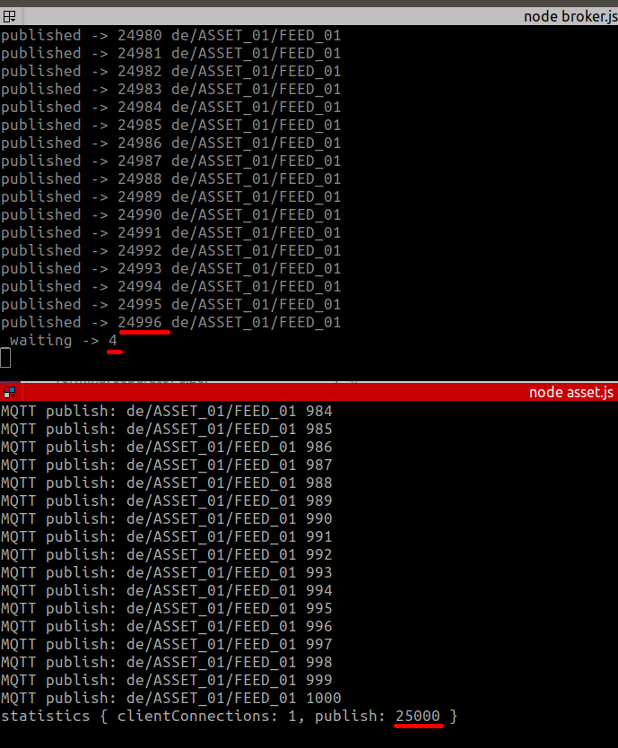

# Software list used in this test

* node 8.11.3
* mongodb 3.4

# Install

```bash
npm install
```

# Modify mqemitter-mongodb for debug

Enter the following code at line 80 of the node_modules/mqemitter-mongodb/mqemitter-mongodb.js:

```javascript
  setInterval(() => {
    console.log("_waiting ->", Object.keys(that._waiting).length)
  }, 3500);
```

# Start broker

```
node broker.js
```

By default the software connects to a local mongodb instance. 

To modify the mongodb connection string, edit the broker.js file and change the url parameter.

The MQTT broker displays all received publish and the incremental number should always be divisible by 1000.

Moreover, it sometimes displays the waiting variable of mqemitter-mongodb.


# Start asset

```
node asset.js
```

This MQTT client publishes 1000 values every 5 seconds.

It shows publish statistics highlighting errors, when they occur.

# Effects

We notify that after a while, there is a mismatch with the number of pubblications received by the broker.

The waiting numbers increase and this value matches with the number of lost publish.



#Test with docker

```
./docker-build
./docker-compose up mongo
./docker-compose up broker
./docker-compose up asset
```